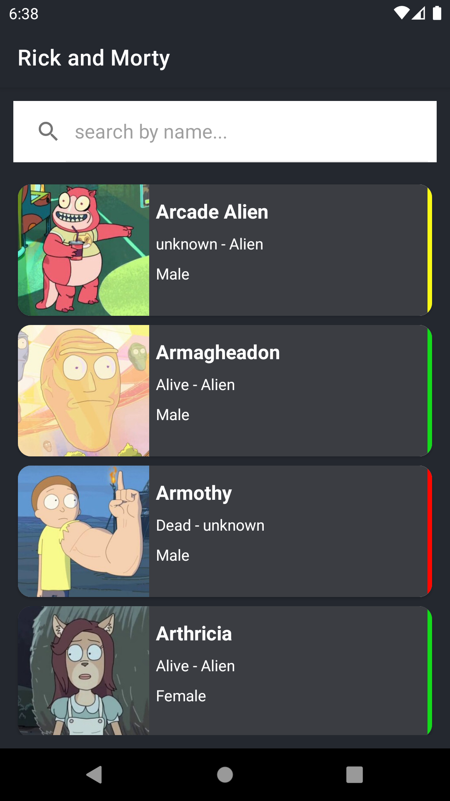
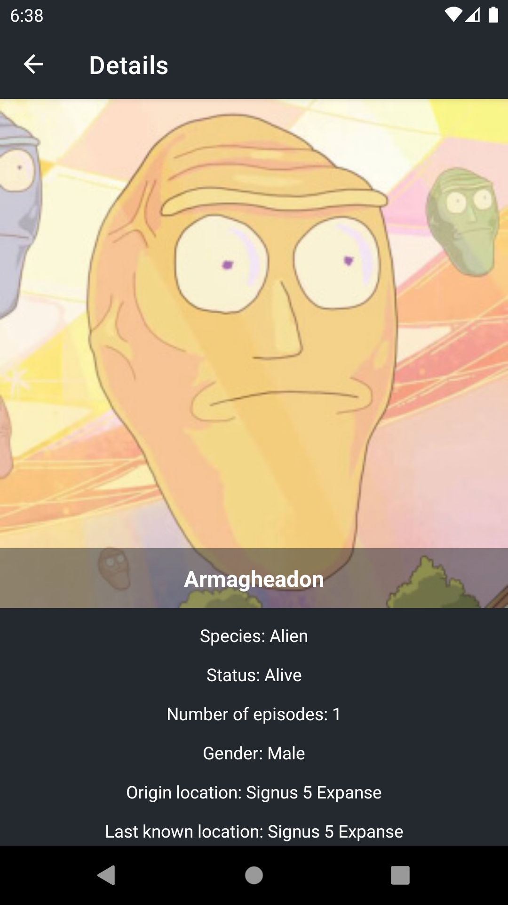

# RickAndMorty
This is a basic Android application that shows [Rick and Morty](https://rickandmortyapi.com/) characters and their details, based on mvvm architecture.

## Apk 
You can also see and download apk file by [this link](https://github.com/ytam/RickAndMorty/blob/main/rickandmorty.apk).

## Tech stack
* ✅ Clean Architecture
* ✅ Repository pattern
* ✅ MVVM
* ✅ Navigation Component
* ✅ Safe-Args
* ✅ Glide
* ✅ Livedata
* ✅ Viewmodel
* ✅ Navigation Component
* ✅ Retrofit
* ✅ Koin
* ✅ Kotlin Coroutines

## Screenshots 📱
 

  
  

## MAD Score 👇

## Automnation UI Test
### How To Run
1. Check out branch `test-ui-auto`
2. Open in Android Studio
3. Open AVD manager and run an AVD
4. Follow [this](https://developer.android.com/training/testing/espresso/setup#set-up-environment) to disable 3 settings in `Developer Options` of AVD 
5. Click "Run" button (you can also right click on `app/src/androidTest/java/io/github/ytam/rickandmorty/ui/main/TestSuite.kt` to run it).

### Implementation
1. Add `UriIdlingResource` in [CharacterFragment.kt](https://github.com/EasonCYS/RickAndMorty/blob/69b9b42457f87d9ead82225f0263b799ebfb074c/app/src/main/java/io/github/ytam/rickandmorty/ui/character/CharacterFragment.kt#L70-L73) to handle the async request to avoid flakiness.
2. Leveraged `Page Object Model` to make sure page attributes and operation are abstract and modulized.
3. Test Cases are organized as Test Suite
